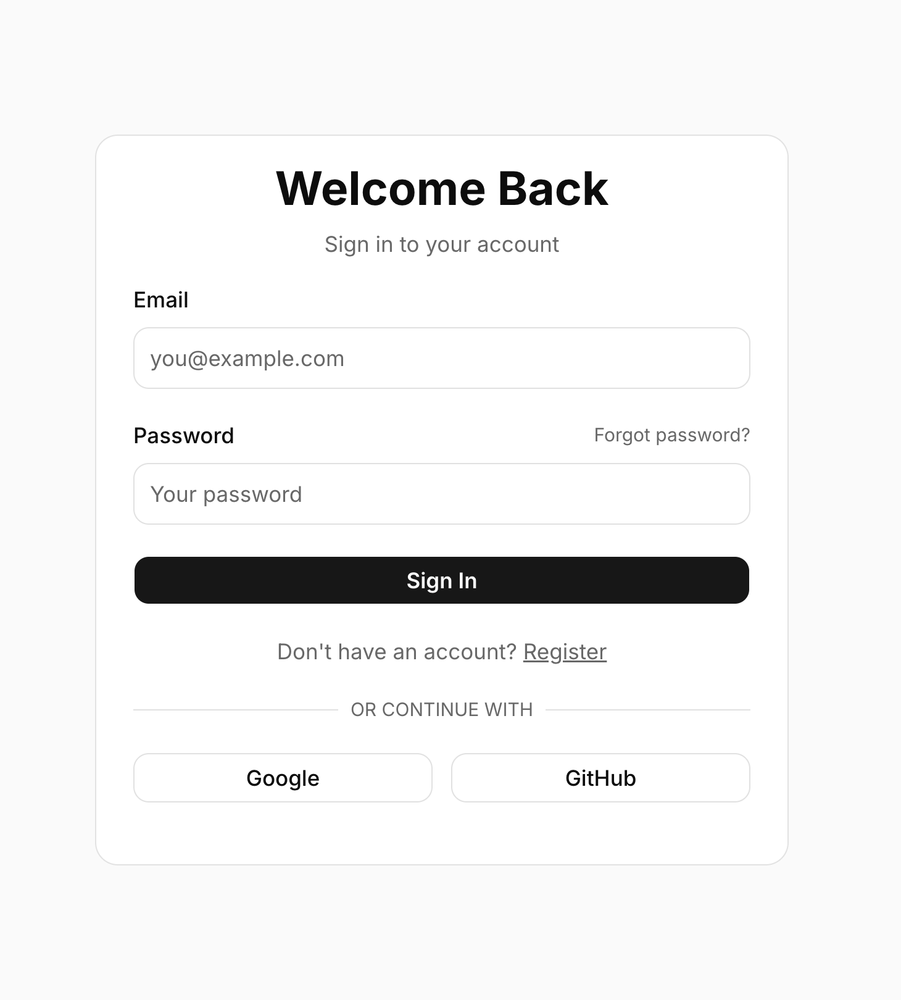
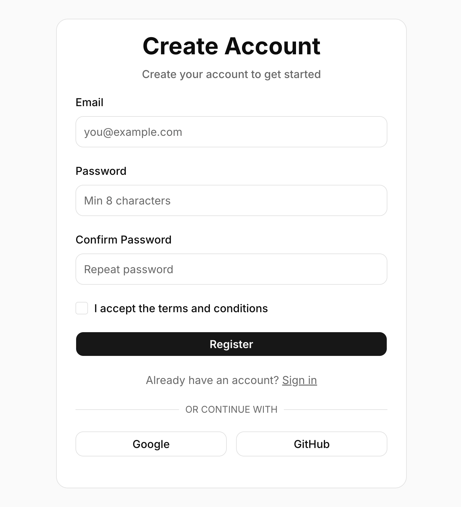
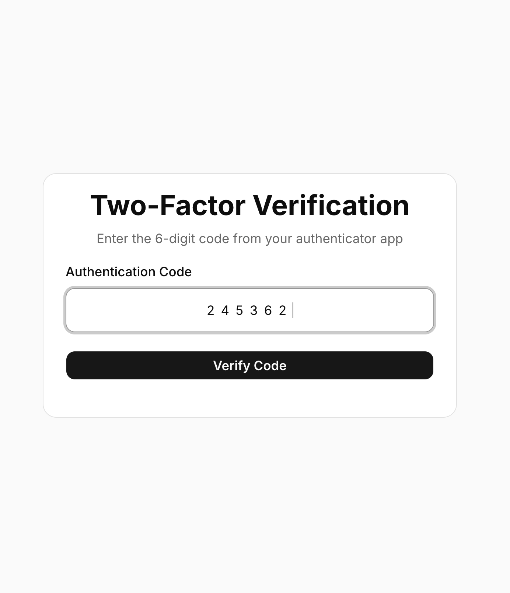
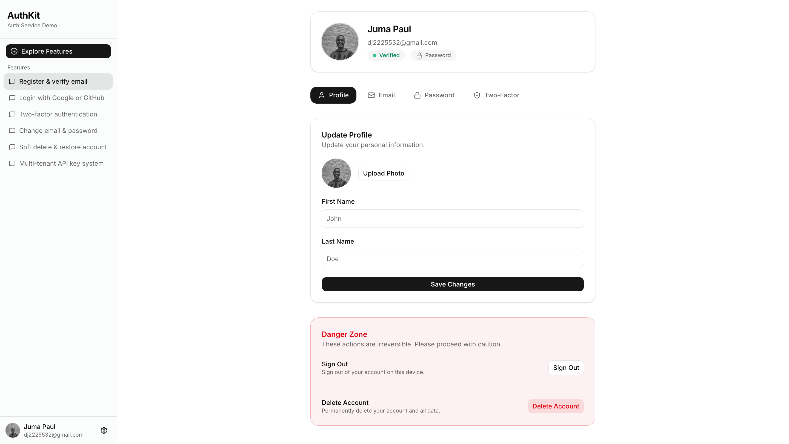
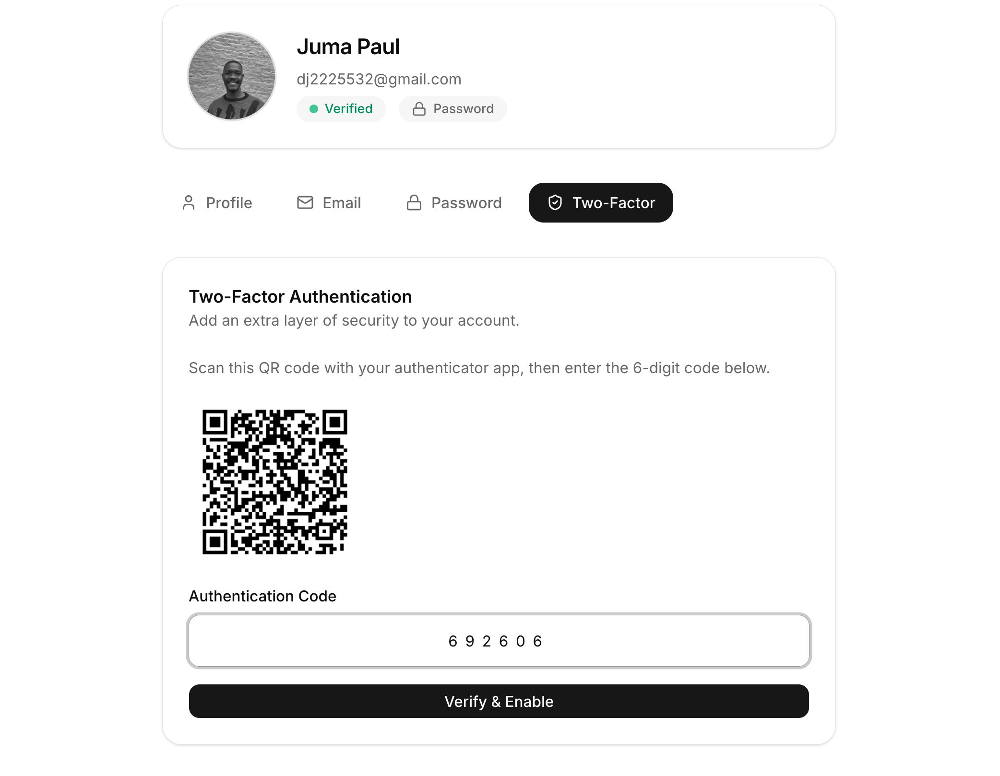
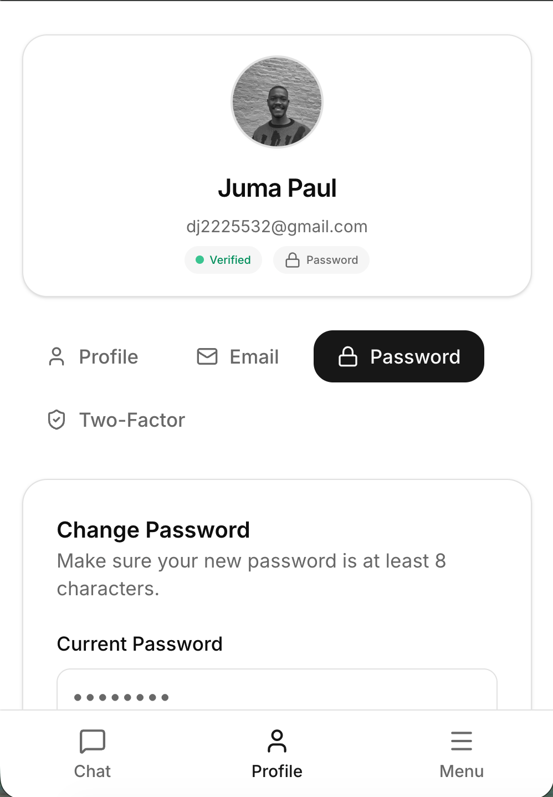

# AuthKit Demo — Interactive Auth Service Demo

<div align="center">


A **production-ready authentication frontend** featuring OAuth integration, Two-Factor Authentication, secure session management, and a polished responsive UI.

[Live Demo](#-live-demo) | [Features](#-features) | [Getting Started](#-getting-started) | [Screenshots](#-screenshots)

</div>

---

## Overview

This project is a comprehensive authentication system frontend built to demonstrate modern security practices and polished user experience. It serves as the client application for a multi-tenant authentication API, showcasing real-world patterns used in production applications.

**Why this project stands out:**
- Implements complete authentication flows (not just login/register)
- Handles edge cases: token refresh, session expiry, rate limiting, account recovery
- Production-quality error handling and user feedback
- Mobile-first responsive design
- Clean, maintainable code architecture

---

## Features

### Authentication
- **Email/Password Login** - Traditional authentication with validation
- **OAuth Integration** - Google and GitHub social login
- **User Registration** - With email verification flow
- **Password Reset** - Secure forgot password with email link
- **Session Management** - Automatic token refresh, secure logout

### Security
- **Two-Factor Authentication (2FA)** - TOTP-based with QR code setup
- **Backup Codes** - Emergency recovery codes for 2FA
- **Account Soft Delete** - 30-day recovery window
- **Account Restoration** - Recover deleted accounts via email
- **Rate Limit Handling** - Graceful degradation with user feedback

### User Experience
- **Responsive Design** - Mobile-first with bottom navigation drawer
- **Toast Notifications** - Contextual feedback for all actions
- **Loading States** - Visual feedback during async operations
- **Form Validation** - Real-time validation with Zod schemas
- **Avatar Upload** - Cloudinary integration for profile images

### Profile Management
- **Update Profile** - Name, avatar customization
- **Change Email** - With verification
- **Change Password** - With session invalidation
- **2FA Management** - Enable/disable with verification

---

## Tech Stack

| Category | Technology |
|----------|------------|
| **Framework** | Next.js 16 (App Router) |
| **Language** | TypeScript |
| **Styling** | Tailwind CSS 4 |
| **UI Components** | shadcn/ui + Radix UI |
| **Forms** | React Hook Form + Zod |
| **State Management** | React Context + TanStack Query |
| **HTTP Client** | Axios with interceptors |
| **Notifications** | Sonner |
| **Icons** | Lucide React |
| **Image Upload** | Cloudinary |

---

## Getting Started

### Prerequisites

- Node.js 18+
- npm, yarn, pnpm, or bun
- Backend API running (see [auth-service](https://github.com/alquatra/auth-service))

### Installation

1. **Clone the repository**
   ```bash
   git clone https://github.com/alquatra/auth-service-demo.git
   cd auth-service-demo
   ```

2. **Install dependencies**
   ```bash
   npm install
   # or
   yarn install
   # or
   pnpm install
   ```

3. **Set up environment variables**
   ```bash
   cp .env.example .env.local
   ```

4. **Configure environment**
   ```env
   NEXT_PUBLIC_API_URL=http://localhost:8000/api
   NEXT_PUBLIC_API_KEY=your_api_key

   # Cloudinary (for avatar upload)
   NEXT_PUBLIC_CLOUDINARY_CLOUD_NAME=your_cloud_name
   CLOUDINARY_API_SECRET=your_api_secret
   ```

5. **Run the development server**
   ```bash
   npm run dev
   ```

6. **Open in browser**
   ```
   http://localhost:3000
   ```

---

## Project Structure

```
src/
├── app/                    # Next.js App Router pages
│   ├── (auth)/            # Authentication pages (login, register, etc.)
│   ├── (dashboard)/       # Protected pages (chat, profile)
│   └── api/               # API utilities and interceptors
├── components/
│   ├── auth/              # Authentication components
│   ├── profile/           # Profile management components
│   ├── shell/             # Layout components (Sidebar, BottomNav)
│   └── ui/                # shadcn/ui components
├── providers/             # React Context providers
├── lib/                   # Utilities and helpers
└── types/                 # TypeScript type definitions
```

---

## Screenshots

<div align="center">

### Login & Registration
<!-- Add your screenshots here -->
| Login | Register | 2FA Verification |
|-------|----------|------------------|
|  |  |  |

### Profile Management
| Profile | 2FA Setup | Mobile View |
|---------|-----------|-------------|
|  |  |  |

</div>

> **Note:** Replace placeholder images with actual screenshots of your application.

---

## Live Demo

<!-- Add your demo link and video here -->

**Demo Video:**

https://github.com/user-attachments/assets/your-video-id

> Upload a screen recording showing the complete authentication flow: registration, email verification, login, 2FA setup, profile management, and logout.

**Live URL:** [Coming Soon](#)

---

## Authentication Flow

```
┌─────────────┐     ┌─────────────┐     ┌─────────────┐
│   Register  │────>│   Verify    │────>│    Login    │
│             │     │    Email    │     │             │
└─────────────┘     └─────────────┘     └──────┬──────┘
                                               │
                    ┌──────────────────────────┤
                    │                          │
                    ▼                          ▼
            ┌─────────────┐           ┌─────────────┐
            │  2FA Check  │           │  Dashboard  │
            │  (if enabled)│           │   /chat     │
            └──────┬──────┘           └─────────────┘
                   │
                   ▼
            ┌─────────────┐
            │  Enter Code │
            │  or Backup  │
            └──────┬──────┘
                   │
                   ▼
            ┌─────────────┐
            │  Dashboard  │
            └─────────────┘
```

---

## Key Implementation Details

### Token Refresh
The Axios interceptor automatically handles 401 errors by:
1. Queuing failed requests
2. Refreshing the access token
3. Retrying queued requests with new token

### Rate Limiting
When the API returns 429, the app:
1. Shows user-friendly toast notification
2. Dispatches custom event for global handling
3. Prevents further requests until cooldown

### Mobile Responsiveness
- Bottom navigation bar on mobile devices
- Sidebar converts to slide-out drawer
- Touch-friendly input sizing
- Responsive grid layouts

---

## Related Projects

- **[auth-service](https://github.com/alquatra/auth-service)** - The backend API powering this frontend

---

## License

This project is open source and available under the [MIT License](LICENSE).

---

<div align="center">

**Built with modern web technologies for learning and demonstration purposes.**

If you found this helpful, consider giving it a star!

</div>
